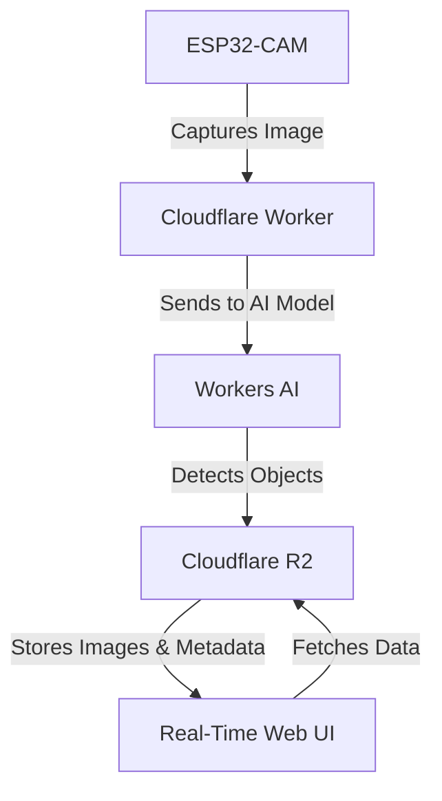

# Building a Security Camera with AI using Cloudflare

## Overview
This project demonstrates how to build a security camera system leveraging Cloudflare Workers, Workers AI, and R2 for real-time object detection and storage. By using an ESP32-CAM to capture images and Cloudflare’s edge infrastructure for AI processing, this solution is scalable, cost-effective, and highly performant.

## Features
- **ESP32-CAM Integration**: Captures images every 5 seconds and sends them to a Cloudflare Worker.
- **Object Detection**: Workers AI analyzes the images to detect objects, providing labels, bounding boxes, and confidence scores.
- **Cloudflare R2 Storage**: Stores images in Base64 format and object detection results as JSON files.
- **Real-Time Web UI**: Visualizes the results with red bounding boxes and labels for detected objects.

## Final Result


## System Architecture


## Prerequisites
- ESP32-CAM module
- Cloudflare account with access to:
  - Workers
  - Workers AI
  - R2 storage

## Setup
### 1. Configure the ESP32-CAM
All of the esp32-cam code is from https://RandomNerdTutorials.com/esp32-cam-http-post-php-arduino/ I've just added a
simple blink feature when the esp is taking a picture.

Full code is available in the [esp32-uploader.ino](./esp32-uploader.ino)

1. Update the code to point into your own worker and your WIFI ssid and password
2. Flash your ESP32-CAM using the instruction in the RandomNerdTutorials linked above

### 2. Deploy the Cloudflare Worker

Install dependencies and login with Cloudflare
```bash
npm install

npx wrangler login
```

Create a R2 Bucket
```bash
npx wrangler r2 bucket create esp32-cam-with-workers-ai
```

Deploy the worker
```bash
npx wrangler deploy
```

## Usage
1. Power on the ESP32-CAM to start capturing images.
2. Monitor the Web UI for real-time results.
3. View stored images and detection metadata in R2.

## License
This project is licensed under the MIT License.
